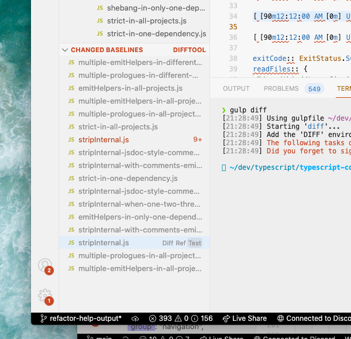

# VS Code TypeScript Dev

[An extension for working in the TypeScript codebase.](https://marketplace.visualstudio.com/items?itemName=Orta.vscode-typescript-dev&ssr=false)

## Features

### Test File Stuff

- Get the character index of your cursor in a fourslash test
- Get auto-complete for twoslash compiler flags

### Syntax Highlighting for Test Files

Adds syntax highlighting for .types and .symbol files in a way which won't fill your screen with errors.
- Symbol files 
- Type Files 

### Changed Baselines Info

Shows up to 100 changed baselines with:

 - Jump to local/reference
 - Show diff
 - Jump to test (most of the time)

Has a button for `gulp diff`.