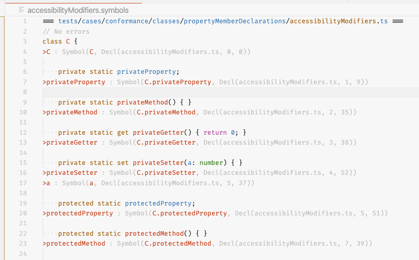

# VS Code TypeScript Dev

[An extension for working in the TypeScript codebase.](https://marketplace.visualstudio.com/items?itemName=Orta.vscode-typescript-dev&ssr=false)

## Features

It's not too smart yet, but:

- it lets you choose a test file and re-run that file easily from anywhere in your editor.
- It adds syntax highlighting for .types and .symbol files in a way which won't fill your screen with errors.

  - Symbol files 

  - Type Files 

### For more information

- [Visual Studio Code's Markdown Support](http://code.visualstudio.com/docs/languages/markdown)
- [Markdown Syntax Reference](https://help.github.com/articles/markdown-basics/)

**Enjoy!**
